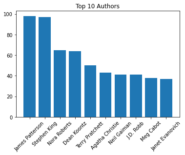
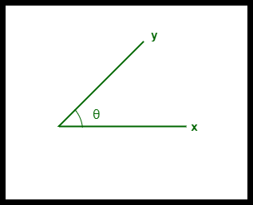
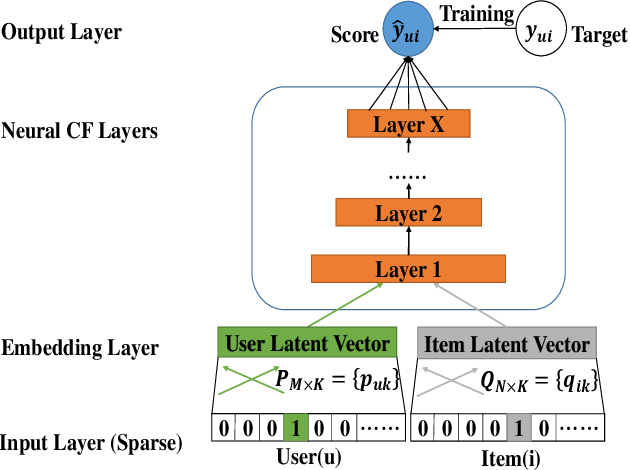
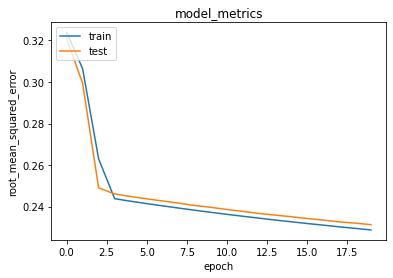

# Laporan Rekomendasi Collaborative Filtering dan Content-Based Filtering

## Project Overview

Membaca merupakan kegiatan melihat tulisan bacaan dan proses memahami isi teks dengan bersuara atau dalam hati[[1]](#1). Bagi sebagian orang, membaca merupakan aktivitas menyenangkan yang sering dilakukan pada waktu senggang, khususnya membaca buku. Hampir semua orang dapat mengidentifikasi buku yang memberikan mereka kesan dan mengubah pola pikir mereka [[2]](#2). Seringnya setelah mereka membaca buku tersebut, mereka ingin menemukan buku yang mirip dengan mereka baca sebelumnya. Untuk itu terdapat sistem rekomendasi yang sering dipasang pada aplikasi jual-beli buku _online_.

Sistem Rekomendasi merupakan perangkat lunak dan teknik yang memberikan saran atau rekomendasi kepada pengguna sebuah aplikasi terhadap sebuah item yang mungkin mereka sukai. Sistem rekomendasi memiliki dampak yang signifikan dalam menemukan minat pengguna[[3]](#3) .Sistem rekomendasi inilah mungkin yang menjadi seseorang memilih sebuah item pada sebuah aplikasi.

Pada laporan ini, dibuatlah sebuah sistem rekomendasi buku menggunakan _Collaborative Filtering_ dan _Content-Based Filtering_. _Collaborative Filtering_ merupakan proses filtrasi informasi atau pola menggunakan teknik yang melibatkan kolaborasi beberapa pengguna,sudut pandang,sumber data dan lain sebagainya [[4]](#4). Sedangkan _Content-Based Filtering_ merupakan metode yang berdasarkan deskripsi item dan profil dari preferensi pengguna[[5]](#5). Laporan ini menggunakan dataset yang berisi nama buku serta buku yang disukai oleh pengguna lainnya untuk membuat model.

## Business Understanding

### Problem Statements

- Bagaimana cara merekomendasikan sebuah buku kepada pengguna berdasarkan buku yang telah dibaca oleh orang lain dan kesamaan pada buku tersebut ?.

### Goals

- Membuat sistem rekomendasi menggunakan _Collaborative Filtering_ dan _Content-Based Filtering_ agar dapat merekomendasikan buku kepada pengguna secara optimal.

### Solution statements

- Terdapat dua pendekatan untuk merekomendasikan sebuah buku kepada pengguna yaitu:
  **_Collaborative Filtering_**
  Sebuah algoritma rekomendasi yang menggunakan preferensi dari berbagai pengguna. Algoritma ini pada dasarnya akan bekerja seperti jika seseorang menyukai item A, dan seseorang yang lain juga menyukai item A, maka kemungkinan besar kedua pengguna tersebut akan menyukai item B. Disini, akan digunakan rating yang diberikan seorang pengguna terhadap sebuah buku. Pada solusi ini , akan digunakan neural network untuk menyelesaikan masalah tersebut dengan metrik evaluasi root mean squared error.
  **_Content-Based Filtering_**
  Sebuah algoritma rekomendasi yang menggunakan persamaan antar dua item untuk merekomendasikan buku kepada pengguna. Algoritma ini bekerja seperti jika seseorang menyukai item A, maka sistem akan merekomendasikan item yang memilki genre atau atribut lain yang mirip dengan item A. Disini, akan digunakan judul dan sinopsis buku untuk menentukan kemiripan antar buku. Pada solusi ini, akan digunakan cosine similartiy dengan metrik evaluasi presisi untuk menyelesaikan masalah ini.
  Setelah membuat model menggunakan dua pendekatan tersebut, akan dicoba untuk merekomendasikan sebuah buku terhadap pengguna berdasarkan pengguna lain dan merekomendasikan top-10 berdasarkan buku lain.

## Data Understanding

Laporan ini menggunakan dataset yang diambil dari situs kaggle dengan nama [goodbooks-10k](https://www.kaggle.com/datasets/zygmunt/goodbooks-10k) . Dataset ini berisi 5 csv _file_ , tetapi disini kita hanya menggunakan 2 _file_ saja yang mana books.csv dan ratings.csv ._File_ books.csv berisi 10 kolom dengan 10,000 observasi informasi general mengenai buku. Sedangkan _file_ ratings.csv berisi 3 kolom dengan 981,756 observasi mengenai rating pengguna terhadap suatu buku.

Variabel-variabel pada **_books.csv_** adalah sebagai berikut:

|                                                                                     |
| :---------------------------------------------------------------------------------: |
| _Tabel 1. Nama,Deskripsi,Tipe data ,dan jumlah data hilang pada variabel books.csv_ |

| Nama                      | Deskripsi                                                                            | Tipe Data | Jumlah Data Hilang |
| ------------------------- | ------------------------------------------------------------------------------------ | --------- | ------------------ |
| id                        | merupakan id berurutan dari 1-1000                                                   | int64     | 0                  |
| book_id                   | merupakan id dari buku                                                               | int64     | 0                  |
| best_book_id              | merupakan id dari versi buku dari book_id                                            | int64     | 0                  |
| work_id                   | merupakan id abstrak dari buku                                                       | int64     | 0                  |
| books_count               | jumlah buku                                                                          | int64     | 0                  |
| isbn                      | International Standard Book Number (kode pengidentifikasian buku yang bersifat unik) | int64     | 700                |
| isbn13                    | ISBN dengan 13 digit angka                                                           | float64   | 585                |
| authors                   | penulis dari buku                                                                    | object    | 0                  |
| original_publication_year | tahun publikasi                                                                      | float64   | 21                 |
| original_title            | judul asli                                                                           | object    | 585                |
| title                     | judul alternatif                                                                     | object    | 0                  |
| language_code             | kode bahasa                                                                          | object    | 1084               |
| average_rating            | rata-rata rating                                                                     | float64   | 0                  |
| ratings_count             | jumlah rating                                                                        | int64     | 0                  |
| work_ratings_count        | jumlah rating abstrak pada buku                                                      | int64     | 0                  |
| work_text_reviews_count   | jumlah review text abstrak pada buku                                                 | int64     | 0                  |
| ratings_1                 | jumlah rating 1                                                                      | int64     | 0                  |
| ratings_2                 | jumlah rating 2                                                                      | int64     | 0                  |
| ratings_3                 | jumlah rating 3                                                                      | int64     | 0                  |
| ratings_4                 | jumlah rating 4                                                                      | int64     | 0                  |
| ratings_5                 | jumlah rating 5                                                                      | int64     | 0                  |
| image_url                 | url dari gambar buku                                                                 | object    | 0                  |
| small_image_url           | url dari gambar buku yang berukuran kecil                                            | object    | 0                  |
|                           |                                                                                      |           |                    |

Variabel-variabel pada **_ratings.csv_** adalah sebagai berikut:

|                                                                                       |
| :-----------------------------------------------------------------------------------: |
| _Tabel 2. Nama,Deskripsi,Tipe data ,dan jumlah data hilang pada variabel ratings.csv_ |

| Nama    | Deskripsi                       | Tipe Data | Jumlah Data Hilang |
| ------- | ------------------------------- | --------- | ------------------ |
| book_id | id dari buku                    | int64     | 0                  |
| user_id | id dari user                    | int64     | 0                  |
| rating  | rating user_id terhadap book_id | int64     | 0                  |

**10 Penulis paling terkenal**

|                                       |
| :-----------------------------------: |
| _Gambar 1. 10 Penulis paling populer_ |

Disini, dapat dilihat dari Gambar 1, bahwa penulis paling banyak masuk ke entri adalah James Patterson. Selain itu dapat dilihat bahwa nilai tertinggi dari penulis tidak menyentuh angka 100, hal tersebut berarti terdapat jumlah penulis yang banyak yang ditemukan pada dataset

**Distribusi Rating**

|                                    |
| :--------------------------------: |
| _Gambar 2. Distribusi Rating Buku_ |

.png>)

Dapat dilihat bahwa distribusi pada rating bersifat _negative skew_ dimana memiliki median lebih besar daripada rata-ratanya yaitu 4.002191

**Tahun Publikasi Terbanyak**

|                                            |
| :----------------------------------------: |
| _Gambar 3. Tahun Publikasi buku terbanyak_ |

.png>)

Dapat dilihat bahwa publikasi terbanyak ditemukan pada tahun 2012 menurut dataset dan dari tahun 2005 hingga 2012, jumlah publikasi selalu bertambah.

**Rata-Rata Rating 10 Penulis Terpopuler**

|                                                 |
| :---------------------------------------------: |
| _Gambar 4. Rerata rating 10 Penulis terpopuler_ |

.png>)

Dapat dilihat pada Gambar 4 , dari 10 penulis diatas, hanya 4 penulis yang memiliki rating diatas rata-rata, yaitu Nora Roberts,Terry Pratchett,Neil Gaiman, dan J.D. Robb

**10 Buku dengan Jumlah Rating Terbanyak**

|                                                 |
| :---------------------------------------------: |
| _Gambar 5. Buku dengan jumlah rating terbanyak_ |

.png>)

Dapat dilihat pada Gambar 5, The Hunger Games memiliki jumlah rating paling banyak dengan angka lebih dari 5 juta rating

## Data Preparation

Pada tahap ini, untuk modelling menggunakan _Content-Based Filtering_, digunakan kolom _orginial,authors,dan rating_ dari _books.csv_ untuk merekomendasikan seorang pengguna terhadap suatu buku karena ketiga hal tersebut dapat merepresentasikan sebuah buku dengan baik.

**Vectorisasi**

Pada tahapan ini, dilakukan penghitungan nilai TF-IDF dari ketiga kolom diatas di dalam dataset dan meletakkannya dalam bentuk vektor. Namun, sebelum melakukan penghitungan, dilakukan pemisahan dari tiap authors di dalam observasi karena setiap buku mungkin memiliki 1 atau lebih authors. Penghitungan nilai TF-IDF dilakukan dengan cara berikut

$$TF(t,d) = \frac{\text{banyaknya jumlah t dalam d}}{\text{total jumlah d}}$$

$$IDF = log\frac{N}{1+DF}$$

$$TF-IDF(t,d) = TF(t,d)*IDF(t)$$

Dimana t adalah _author_ , d adalah _observasi_ ,dan DF adalah banyak observasi dengan _author_ d. Setelah melakukan proses penghitungan nilai TF-IDF, dilakukan perubahan bentuk dari hasil TF-IDF menjadi dense karena untuk melakukan modelling, dibutuhkan input berupa vektor, sehingga diperlukannya perubahan bentuk tersebut.

 

Pada _Collaborative Filtering_, digunakan dataset _ratings.csv_ dengan kolom user_id,book_id ,dan rating

**Encoding**

Pada tahapan ini, data akan di enkodekan menjadi angka 1 hingga jumlah banyak buku yang ada, karena pada dataset yang didapat, data pada kolom _user_id_ dan _book_id_ masih berbentuk acak dan tidak terurut. Setelah melakukan encoding, data pada _user_id_ dan _book_id_ akan menjadi terurut. Encoding dilakukan dengan cara memindai seluruh data dan menyimpan seluruh _user_id_ dan _book_id_ yang ada. Lalu data tersebut akan di-_mappingkan_ dengan angka 1 hingga jumlah setiap _user_id_ dan _book_id_. Seluruh tahapan ini dilakukan agar data lebih terorganirsir.

**Scaling**

Pada tahapan ini, kolom _rating_ akan diskalakan agar pada saat memasukkan data input ke _neural network_, weight yang didapat relative bernilai tidak besar karena hal tersebut dapat menyebabkan model tidak stabil ketika melakukan training yang mana dapat menghasilkan performa yang buruk dan model tidak dapat menggeneralisasikan masalah dengan baik. Untuk proses ini, digunakan MinMaxScaling yang mana akan menskalakan data di dalam range 0-1 dengan formula sebagai berikut.

$$x_{scaled} = \frac{x-x_{min}}{x_{max}-x_{min}}$$

**Split dataset (train,test)**

Hal ini bertujuan untuk melakukan pelatihan model dan melihat hasil model . Disini dataset dibagi menjadi train dimana subset tersebut digunakan untuk melakukan pelatihan ,sedangkan test dimana subset tersebut digunakan untuk mengevaluasi hasil model dengan porsi 80:20 . Untuk melakukan hal tersebut, terdapat fungsi di python yang bernama sklearn.model_selection.train_test_split yang berfungsi untuk membagi dataset

## Modeling

Untuk membuat model sistem rekomendasi, terdapat dua model yang akan digunakan, yaitu **Content-Based Filtering** dan **Colaborative Filtering**.

**Content-Based Filtering**

Untuk model ini, digunakan cosine similarity untuk menentukan seberapa mirip satu item dengan item lainnya dengan menggunakan kolom _authors_ pada _books.csv_ dataset. Pada proses preparasi data sebelumnya, telah dilakukan vektorisasi untuk mengubah nilai setiap judul dari buku menjadi vektor representasi sehingga dapat dilakukan proses menghitung similaritas satu vektor dengan vektor yang lain dengan formula sebagai berikut.

|                                        |
| :------------------------------------: |
| _Gambar 6. Cosine Similarity 2 Vektor_ |

$$\text{similarity}=cos(\theta)=\frac{AB}{|A| |B|}$$

Dengan menggunakan formula tersebut, jika 2 item memiliki similarity 0, maka kedua item tersebut sangat identik dan sebaliknya.
Keuntungan dari menggunakan cosine similarity adalah metode ini tidak memperdulikan besaran dari perbedaan antara 2 vektor, tetapi hanya memperdulikan arah dan orientasi dari vektor tersebut. Namun hal tersebut juga menjadi kekurangan, karena bisa saja terdapat 1 vektor yang lebih besar dari dari yang lain dan algoritma tersebut tidak dapat mengkalkulasi hal tersebut.

Setelah membangun model tersebut, telah didapatkan top-10 rekomendasi buku dengan buku sebagai acuan adalah "Twilight"

|                                                                   |
| :---------------------------------------------------------------: |
| _Tabel 3. 5 rekomendasi buku berdasarkan Content-Based Filtering_ |

| no  | title                 | authors         |
| --- | --------------------- | --------------- |
| 1   | The Host              | Stephenie Meyer |
| 2   | The Chemist           | Stephenie Meyer |
| 3   | Eclipse               | Stephenie Meyer |
| 4   | Breaking Dawn         | Stephenie Meyer |
| 5   | The Return: Nightfall | L.J. Smith      |

**Collaborative Filtering**

Untuk membuat model ini, digunakan _neural network_ untuk menentukan seberapa mirip seorang user dengan user lainnya dan merekomendasikan user kedua berdasarkan apa yang disukai user pertama. Model _neural network_ dibangun dengan arsitektur sebagai berikut.

Data Input hasil preparasi data akan dimasukkan ke dalam _Embedding Layer_ yang mana bertujuan untuk mereprentasikan bentuk _user_ dan _book_ ke dalam bentuk vektor. Setelah itu, kedua layer tersebut akan dikalikan dan terakhir akan dijumlahkan dengan bias dari _user_ dan _book_. Namun pada model yang dibangun ini , tidak menggunakan _hidden layer_ melainkan langsung masuk ke dalam _activation function_ yang berupa sigmoid karena bentuk output yang dinginkan dalam bentuk biner. Untuk _loss function_ yang digunakan adalah _BinaryCrossentropy_ dan menggunakan _AdamOptimizer_ untuk optimizernya. Lalu dilakukan proses fit model dengan epoch atau iterasi sebanyak 20 kali dan dibagi menjadi 128 batch Keuntungan dari menggunakan metode ini adalah hasil model yang dapat melakukan rekomendasi dengan baik . Namun, kerugiannya adalah waktu yang digunakan untuk melatih model tersebut relatif lama.

Setelah membangun model tersebut, telah didapatkan top-10 rekomendasi buku dengan acuan user 3841 sebagai berikut

|                                                                    |
| :----------------------------------------------------------------: |
| _Tabel 4. 10 rekomendasi buku berdasarkan Collaborative Filtering_ |

| no  | title                                                                 | authors                             |
| --- | --------------------------------------------------------------------- | ----------------------------------- |
| 1   | The Curious Incident of the Dog in the Night-Time                     | Mark Haddon                         |
| 2   | Girl with a Pearl Earring                                             | Tracy Chevalier                     |
| 3   | A People's History of the United States                               | Howard Zinn                         |
| 4   | Still Life with Woodpecker                                            | Tom Robbins                         |
| 5   | The Last Juror                                                        | John Grisham                        |
| 6   | The Millionaire Next Door: The Surprising Secrets of Americas Wealthy | Thomas J. Stanley, William D. Danko |
| 7   | Tears of the Giraffe (No. 1 Ladies' Detective Agency, #2)             | Alexander McCall Smith              |
| 8   | The Beautiful and Damned                                              | F. Scott Fitzgerald                 |
| 9   | Villa Incognito                                                       | Tom Robbins                         |
| 10  | The Taste of Home Cookbook                                            | Janet Briggs, Beth Wittlinger       |

## Evaluation

**Content-Based Filtering**

Untuk melakukan evaluasi pada solusi ini menggunakan presisi dimana dihitung menggunakan formula sebagai berikut

$$Precision = \frac{\text {number of relevant recommendation}}{\text{number of recommendation}}$$

Dari hasil model _Content-Based Filtering_ pada tabel 3, dapat disimpulkan hasilnya sebagai berikut

1. The Host merupakan buku dengan author yang sama
2. The Chemist merupakan buku dengan author yang sama dan keluar publikasi setelah The Host
3. Eclipse merupakan buku dengan author yang sama dan merupakan sequel dari Twilight
4. Breaking Dawn merupakan buku dengan author yang sama dan merupakan sequel dari Twilight
5. The Return: Nightfall merupakan buku yang memiliki tema sama dengan Twilight

Sehingga kelima rekomendasi tersebut relevan dan memiliki presisi sebagai berikut,

$$Precision = \frac{5}{5} = 1.$$

Secara general, model dapat merekomendasikan secara benar dengan baik.

**Collaborative Filtering**

Untuk melakukan evaluasi pada solusi ini menggunakan _root mean squared error_ (RMSE) atau akar dari rata-ratanya dengan formula sebagai berikut

$$RMSE = \sqrt{\sum_{i=1}^{n}\frac{(\hat{y_{i}}-y_{i})^2}{n}}$$

Dalam pelatihan model, didapatkan skor training dan validasi sebagai berikut

|                                              |
| :------------------------------------------: |
| _Gambar 7. Kurva RMSE Training dan Validasi_ |

Dapat dilihat dari Gambar , bahwa nilai RMSE yang didapat dari training dan evaluasi model menunjukkan nilai yang hampir mirip dan kecil. Hal tersebut menunjukkan bahwa model bersifat good fit. Dengan 20 epoch, telah didapatkan RMSE training sebesar 0.2288 dan RMSE evaluasi sebesar 0.2313 .

**Kesimpulan**

Berdasarkan hasil dari _content-based filtering_ dan _collaborative filtering_ dapat disimpulkan bahwa kedua hasil tersebut relevan dengan masing-masing acuan. Hanya saja berbeda dalam metode dan hasilnya. Untuk _Content-Based Filtering_ , hasil yang didapat berdasarkan fitur dari buku tersebut sendiri, seperti penulis,judul ,dan rating. Sedangkan _Collaborative Filtering_, didapatkan hasil berdasarkan persamaan rating yang disukai oleh user satu dan user lainnya.

## Referensi

<a id="1" href="https://osf.io/preprints/inarxiv/fe53j/download">[1]</a>
Nurdjan, dkk. (2016). Bahasa Indonesia untuk Perguruan Tinggi. Makassar: Penerbit Aksara Timur. ISBN 978-602-73433-6-8.

<a id="2" href="https://doi.org/10.1089/brain.2013.0166">[2]</a>
Berns, G. S., Blaine, K., Prietula, M. J., & Pye, B. E. (2013). Short- and long-term effects of a novel on connectivity in the brain. Brain connectivity, 3(6), 590–600.

<a id="3" href="https://doi.org/10.1089/brain.2013.0166">[3]</a>
Alluhaidan, A. 2013. Recommender System Using Collaborative Filtering Algorithm, Technical Library: School of Computing and
Information Systems, paper 155.

<a id="4" href="http://www.grouplens.org/papers/pdf/rec-sys-overview.pdf">[4]</a>
Terveen, Loren & Hill, Will (2001). "Beyond Recommender Systems: Helping People Help Each Other".Addison-Wesley.6.

<a id="5" href="https://en.wikipedia.org/wiki/Special:BookSources/9783319296579">[5]</a>
Aggarwal, Charu C. (2016). Recommender Systems: The Textbook. Springer. ISBN 9783319296579.
